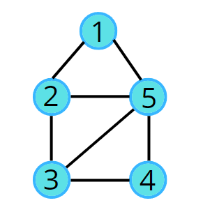

# bfs

## ❓ Problem Statement
Given an undirected graph, return a vector of all nodes by traversing the graph using breadth-first search (BFS).

### example test cases
Example 1:
  
Output: 1 2 5 3 4

Example 2:
    
Output: 1 2 7 3 6 8 10 4 5 9


---
## 💡 Approaches

### 📌 Approach 1 
we will use queue data structure and a visited array, while q not become empty we will check if visited and will push that node again if not visited and pop the current node
#### Code (C++)
```cpp
#include <bits/stdc++.h>
using namespace std;

class Solution {
  public:
    // Function to return Breadth First Traversal of given graph.
    vector<int> bfsOfGraph(int V, vector<int> adj[]) {
        int vis[V] = {0}; 
        vis[0] = 1; 
        queue<int> q;
        // push the initial starting node 
        q.push(0); 
        vector<int> bfs; 
        // iterate till the queue is empty 
        while(!q.empty()) {
           // get the topmost element in the queue 
            int node = q.front(); 
            q.pop(); 
            bfs.push_back(node); 
            // traverse for all its neighbours 
            for(auto it : adj[node]) {
                // if the neighbour has previously not been visited, 
                // store in Q and mark as visited 
                if(!vis[it]) {
                    vis[it] = 1; 
                    q.push(it); 
                }
            }
        }
        return bfs; 
    }
};

void addEdge(vector <int> adj[], int u, int v) {
    adj[u].push_back(v);
    adj[v].push_back(u);
}

void printAns(vector <int> &ans) {
    for (int i = 0; i < ans.size(); i++) {
        cout << ans[i] << " ";
    }
}

int main() 
{
    vector <int> adj[6];
    
    addEdge(adj, 0, 1);
    addEdge(adj, 1, 2);
    addEdge(adj, 1, 3);
    addEdge(adj, 0, 4);

    Solution obj;
    vector <int> ans = obj.bfsOfGraph(5, adj);
    printAns(ans);

    return 0;
}
```
#### TC and SC
- **Time Complexity:** O(V + 2E)  
Each node is visited at most once → O(V)  
Each edge is traversed twice (once from u, once from v) → O(2E)
- **Space Complexity:** O(V + 2E)(space taken by adj list) + O(V)(space taken by vis array) + O(V)(for queue) + o(V) for storing bfs result , so overall O(V + E + 3V) = O(v + e).


---

## 📝 Notes
when you are poping the queue then store that value in ans array or print as given in the question