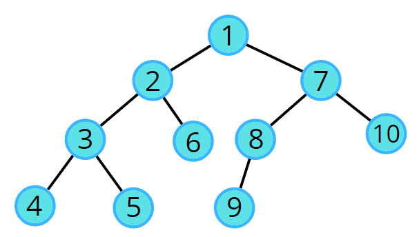

# dfs

## Problem Statement

Given an undirected graph, return a vector of all nodes by traversing the graph using depth-first search (DFS).

### example test cases

Example 2:  
Input:  
  
Output: 1 2 3 4 5 6 7 8 9 10
---
## 💡 Approaches

### 📌 Best Approach 
DFS is a traversal technique which involves the idea of recursion and backtracking. DFS goes in-depth, i.e., traverses all nodes by going ahead, and when there are no further nodes to traverse in the current path, then it backtracks on the same path and traverses other unvisited nodes. 

In DFS, we start with a node ‘v’, mark it as visited and store it in the solution vector. It is unexplored as its adjacent nodes are not visited.
We run through all the adjacent nodes, and call the recursive dfs function to explore the node ‘v’ which has not been visited previously. This leads to the exploration of another node ‘u’ which is its adjacent node and is not visited. 
The adjacency list stores the list of neighbours for any node. Pick the neighbour list of node ‘v’ and run a for loop on the list of neighbours (say nodes ‘u’ and ‘w’ are in the list). We go in-depth with each node. When node ‘u’ is explored completely then it backtracks and explores node ‘w’.
This traversal terminates when all the nodes are completely explored. 

#### Code (C++)
```cpp
// [P#include <bits/stdc++.h>
using namespace std;

class Solution {
  private: 
    void dfs(int node, vector<int> adj[], int vis[], vector<int> &ls) {
        vis[node] = 1; 
        ls.push_back(node); 
        // traverse all its neighbours
        for(auto it : adj[node]) {
            // if the neighbour is not visited
            if(!vis[it]) {
                dfs(it, adj, vis, ls); 
            }
        }
    }
  public:
    // Function to return a list containing the DFS traversal of the graph.
    vector<int> dfsOfGraph(int V, vector<int> adj[]) {
        int vis[V] = {0}; 
        int start = 0;
        // create a list to store dfs
        vector<int> ls; 
        // call dfs for starting node
        dfs(start, adj, vis, ls); 
        return ls; 
    }
};

void addEdge(vector <int> adj[], int u, int v) {
    adj[u].push_back(v);
    adj[v].push_back(u);
}

void printAns(vector <int> &ans) {
    for (int i = 0; i < ans.size(); i++) {
        cout << ans[i] << " ";
    }
}

int main() 
{
    vector <int> adj[5];
    
    addEdge(adj, 0, 2);
    addEdge(adj, 2, 4);
    addEdge(adj, 0, 1);
    addEdge(adj, 0, 3);

    Solution obj;
    vector <int> ans = obj.dfsOfGraph(5, adj);
    printAns(ans);

    return 0;
}ASTE_YOUR_BEST_APPROACH_CODE_SOLUTION_HERE]

```
#### TC and SC
- **Time Complexity:** O(N) + O(2E)
- **Space Complexity:** O(3N)

---

### Approach 1
[EXPLAIN_APPROACH_1_LOGIC_HERE]
#### Code (C++)
```cpp
// [PASTE_CODE_FOR_APPROACH_1_HERE]

```
#### TC and SC
- **Time Complexity:** [ADD_TIME_COMPLEXITY_HERE]
- **Space Complexity:** [ADD_SPACE_COMPLEXITY_HERE]

---

### Approach 2
[EXPLAIN_APPROACH_2_LOGIC_HERE]
#### Code (C++)
```cpp
// [PASTE_CODE_FOR_APPROACH_2_HERE]

```
#### TC and SC
- **Time Complexity:** [ADD_TIME_COMPLEXITY_HERE]
- **Space Complexity:** [ADD_SPACE_COMPLEXITY_HERE]

---

## 📝 Notes

[ADD_ANY_ADDITIONAL_NOTES_OR_KEY_TAKEAWAYS_HERE]
