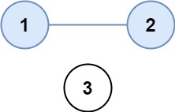

# Number of provinces

### Problem [Link](https://leetcode.com/problems/number-of-provinces/description/)

## Problem Statement

There are n cities. Some of them are connected, while some are not. If city a is connected directly with city b, and city b is connected directly with city c, then city a is connected indirectly with city c.  

A province is a group of directly or indirectly connected cities and no other cities outside of the group.  

You are given an n x n matrix isConnected where isConnected[i][j] = 1 if the ith city and the jth city are directly connected, and isConnected[i][j] = 0 otherwise.

Return the total number of provinces.

### Example test cases

  
Input: isConnected = [[1,1,0],[1,1,0],[0,0,1]]  
Output: 2


---
## 💡 Approaches

### 📌 Best Approach 
Same for both DFS and BFS:  

Time=O(V+E)  
V = number of vertices  
E = number of edges

Reason:
Every node is visited once: O(V)

Every edge is traversed once (undirected, so each edge touches 2 nodes): O(E)

#### TC and SC
- **Time Complexity:** O(V+E)
- **Space Complexity:**  DFS and BFS have the same overall space complexity: O(V + E)

Space complexity

for undirected O(V+2E) -> the space occupied by adj list
---

### Approach 1 (Using BFS)
Just like connected component question where we use  
```cpp
// our classic traversing concept
// let the number of verties is v
for(int i = 0 ; i<V ; i++){
    if(vis[i] == 0){
        bfs(i);
        // or dfs(i)
    }
}

```
#### Code (C++)
```cpp
class Solution {
public:
int findCircleNum(vector<vector<int>>& isConnected) {
    int n = isConnected.size();          // Number of cities (nodes)
    vector<int> vis(n, 0);               // Visited array: vis[i] = 1 means city i is already visited
    int count = 0;                       // Count of provinces

    for (int i = 0; i < n; i++) {        // For every city
        if (!vis[i]) {                   // If not visited yet, start a BFS
            count++;                     // New province found
            queue<int> q;
            q.push(i);
            vis[i] = 1;

            while (!q.empty()) {
                int node = q.front(); q.pop();

                for (int j = 0; j < n; j++) {
                    if (isConnected[node][j] == 1 && !vis[j]) {
                        vis[j] = 1;
                        q.push(j);
                    }
                }
            }
        }
    }

    return count;
}

};
```
#### TC and SC
- **Time Complexity:** O(V+E)
- **Space Complexity:** O(V+E)

---

### Approach 2
Do it with dfs

#### TC and SC
- **Time Complexity:** O(V+E) same as bfs
- **Space Complexity:** O(V+E) same as bfs

---

## 📝 Notes

### 1. **How are we traversing this adj matrix given in this question?**
we counted the number of vertex and using one for loop 
```cpp

for(int i = 0 ; i<n ; i++){
    int node = i;
for (int j = 0; j < n; j++) {
    isConnected[node][j];
    // to avoid self use we will use visited array
}
}
```
- This ensures every cell in the grid is visited.
- For every unvisited `1`, we launch a BFS/DFS to mark all connected `1`s.

---

### 2. **0-based vs 1-based indexing?**
- In the **code**, everything is handled using **0-based indexing**.
- Even if the input grid is shown with 1-based positions in examples, **actual matrix representation in programming is 0-based**.

So, no special change is required.

---

### 3. **How are we dealing with self-loops (`grid[i][i]`)**?
If a node/cell has a self-loop (`grid[i][i] == 1`), it doesn’t change anything.

Why?
- The BFS/DFS always checks if a cell is already visited: `vis[i][j] == 1`
- If it's already visited, we **skip it**, so even if `grid[i][i] == 1`, it won't be processed twice.

---

### 4. **Why do we initialize `vis` with `0` and not mark self loops?**
```cpp
vector<vector<int>> vis(n, vector<int>(m, 0));
```
- All cells are unvisited initially.
- We mark them `1` only **when** they are visited **during BFS/DFS traversal**.
- So, self-loop (`i == j`) or not, only visited nodes get updated.

---


