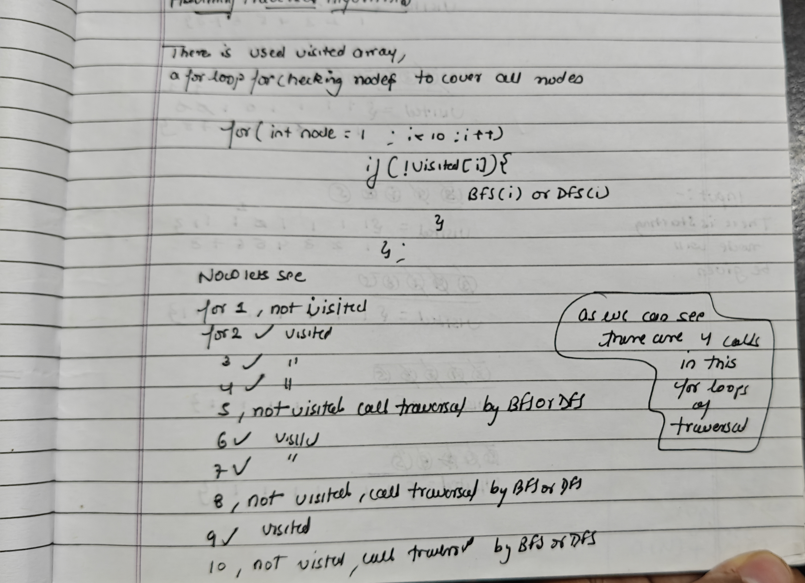

# Number of Islands
In this we will learn how to use graphs on a 2D Grid
### Problem [Link](https://leetcode.com/problems/number-of-islands/description/)

## Problem Statement
Given an m x n 2D binary grid grid which represents a map of '1's (land) and '0's (water), return the number of islands.  
An island is surrounded by water and is formed by connecting adjacent lands horizontally or vertically. You may assume all four edges of the grid are all surrounded by water.

### example test cases

Example 1:

Input: 
```cpp
grid = [
  ["1","1","1","1","0"],
  ["1","1","0","1","0"],
  ["1","1","0","0","0"],
  ["0","0","0","0","0"]
]
Output: 1
```
---
## 💡 Approaches

### 📌 Best Approach
We can try dsu (Disjoint Set Union) to solve the Number of Islands problem. This approach is efficient and leverages the union-find data structure to manage connected components in the grid.

The DSU approach is particularly useful for problems involving connectivity in a grid, as it allows us to efficiently union adjacent land cells and find the number of distinct islands.  

The DSU approach is similar in concept to BFS (Breadth-First Search) and DFS (Depth-First Search) approaches, but it uses a union-find structure to manage the connectivity of the grid cells.  

The DSU approach can be more efficient in terms of union operations, especially when dealing with large grids or when the grid is dynamic (i.e., cells can be added or removed).  


#### Explanation

1. **Initialization**: Create a DSU structure to manage the grid cells.
```cpp
class DSU{
vector<int>parent;
public:
    DSU(int n){
        parent.resize(n);
        iota(parent.begin(), parent.end() , 0); // shortest way to do parent[i] = i for all i
    }

    int find(int x){
        if(x == parent[x]){
            return x;
        }
        return parent[x] = find(parent[x]);  // Path Compression
    }

    
    void unionn(int x , int y){
        int px = find(x);
        int py = find(y);

        if(px != py){
            parent[px] = py;
        }
    }

    bool isConnected(int x , int y){
        if(find(x) == find(y)){
            return true;
        }

        return false;
    }

};    
```
2. **Traversal of the grid**: For each land cell ('1') first do count++, check its adjacent cells (up, down, left, right). If an adjacent cell is also land, find its parents or use isConnected() if not connected then call union function to unite then and do count--.

  
#### Code (C++)
```cpp
class DSU{
vector<int>parent;
public:
    DSU(int n){
        parent.resize(n);
        iota(parent.begin(), parent.end() , 0);

    }

    int find(int x){
        if(x == parent[x]){
            return x;
        }
        return parent[x] = find(parent[x]);  // Path Compression


    }
    
    void unionn(int x , int y){
        int px = find(x);
        int py = find(y);

        if(px != py){
            parent[px] = py;
        }
    }

    bool isConnected(int x , int y){
        if(find(x) == find(y)){
            return true;
        }

        return false;
    }

};

class Solution {
public:

int numIslands(vector<vector<char>>& grid) {
    int n = grid.size();
    int m = grid[0].size();

    DSU dsu(m * n);
    int count = 0;
    
    int dx[4] = {0 , -1 , 0 , 1};
    int dy[4] = {1 , 0 , -1 , 0};

    for(int i =0  ; i<n ; i++){
        for(int j = 0 ; j<m ; j++){
            if(grid[i][j] == '1'){
                count++;

                for(int s = 0 ; s<4 ; s++){
                    int ni = i + dx[s];
                    int nj = j + dy[s];

                    if(ni >= 0 && ni < n && nj >= 0 && nj < m && grid[ni][nj] == '1' ){
                        int id1 = i* n + j;
                        int id2 = ni * n + nj;

                        if(!dsu.isConnected(id1, id2)){
                            dsu.unionn(id1 , id2);
                            count--;
                        }
                    }
                }
            }
        }
    }

    return count ;
    }
};

```
#### TC and SC
The asymptotic time and space complexity of DSU, BFS, and DFS for the Number of Islands problem is the same: O(n × m) in both time and space.

---

### Approach 1
Using DFS (Depth-First Search) to traverse the grid and count the number of islands on each calling of the dfs approah. This approach is straightforward and works well for this problem.

### Key concept
we will use here our old approach of traversal to include all the graphs 

```cpp
for(int i = 0 ; i<V ; i++){
    if(vis[i] == 0){
        dfs(i , vis); // Here we will call dfs function to traverse all the nodes connected to i
    }
}
```

#### Code (C++)
```cpp
void dfs(int x , int y , vector<vector<char>>&grid , vector<vector<int>>&vis , int n , int m){
    
    vis[x][y] = 1;
    int dx[4] = { -1 , 0 , 1 , 0};
    int dy[4] = {0 , 1 , 0 , -1};

    for(int i =0 ; i<4 ; i++){
        int delx = x + dx[i];
        int dely = y + dy[i];

        if(delx >= 0 && delx <n && dely >= 0 && dely <m && vis[delx][dely] == 0 && grid[delx][dely] == '1'){
            vis[delx][dely] = 1;
            dfs(delx , dely , grid , vis , n , m);
        }
    }
}

int numIslands(vector<vector<char>>& grid) {
    int n = grid.size();
    int m = grid[0].size();
    vector<vector<int>>vis(n , vector<int>(m,0));
    int count = 0;

    for(int i = 0 ; i<n ; i++){
        for(int j = 0 ; j<m ; j++){
            if(vis[i][j] == 0 && grid[i][j] == '1'){
                count++;
                dfs(i , j , grid , vis , n , m);
            }
        }
    }

    return count;

    }


```
#### TC and SC
- **Time Complexity:** O(n × m)
  - Each cell is visited once.
- **Space Complexity:** O(n × m)
  - The space complexity is due to the recursion stack in DFS and the visited array.

---

### Approach 2
Using BFS (Breadth-First Search) to traverse the grid and count the number of islands on each calling of the bfs functon. This approach is also straightforward and works well for this problem.
#### Code (C++)
```cpp
class Solution {
public:

int numIslands(vector<vector<char>>& grid) {
    int n = grid.size();
    int m = grid[0].size();
    vector<vector<int>>vis(n , vector<int>(m,0));
    int count = 0;

    for(int i = 0 ; i<n ; i++){
        for(int j = 0 ; j<m ; j++){
            if(vis[i][j] == 0 && grid[i][j] == '1'){
                count++;
                queue<pair<int, int>>q;
                q.push({i , j});
                vis[i][j] = 1;

                while(!q.empty()){
                    int x = q.front().first;
                    int y = q.front().second;

                    q.pop();

                    int dx[4] = {0, -1, 0 , 1};
                    int dy[4] = {1 , 0 , -1 , 0 };

                    for(int s = 0 ; s<4 ; s++){ // NOTE: not to initialize it with i
                        int newx = i + dx[s];
                        int newy = j + dy[s];

                        if(newx >= 0 && newx < n && newy >= 0 && newy < m && grid[newx][newy] == '1' && vis[newx][newy] == 0 ){
                            vis[newx][newy] = 1;
                            q.push({newx , newy});
                        }
                    }
                }
            }
        }
    }

    return count;

    }
};
```
#### TC and SC
- **Time Complexity:**  O(n × m)
  - Each cell is visited once.
- **Space Complexity:** O(n × m)
  - The space complexity is due to the queue used in BFS and the visited array.

---

## 📝 Notes
- The DSU approach is efficient for problems involving connectivity in grids, especially when the grid is dynamic or queries is given , In this problem we cannot see any difference because of cosntant adding.
