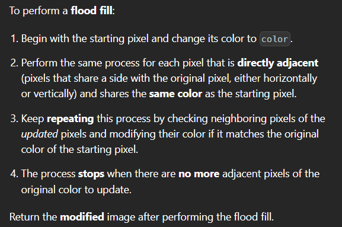
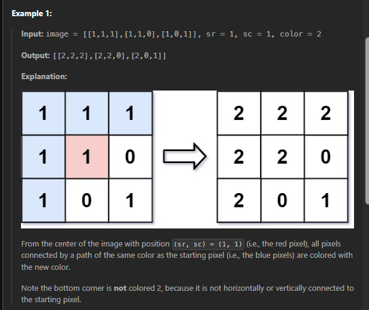
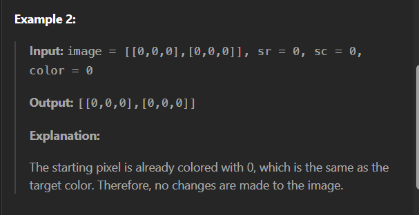

# Flood Fill

### Problem [Link](https://leetcode.com/problems/flood-fill/)

## Problem Statement

You are given an image represented by an m x n grid of integers image, where image[i][j] represents the pixel value of the image. You are also given three integers sr, sc, and color. Your task is to perform a flood fill on the image starting from the pixel image[sr][sc].


### example test cases



---
## 💡 Approaches


### Approach 1
We can use Depth-First Search (DFS) to traverse the image and change the color of the pixels connected to the starting pixel. The DFS will explore all four directions (up, down, left, right) from the current pixel and change the color if the pixel matches the original color. , we have to store the color which have to color.
#### Code (C++)
```cpp
class Solution {
public:

    void dfs(int sr , int sc , int starting_color ,int color, vector<vector<int>>&vis , vector<vector<int>>&image , int n , int m){
        vis[sr][sc] = 1;
        image[sr][sc] = color;
        
        int dx[4] = {-1 , 0 , 1, 0};
        int dy[4] = {0 , 1 , 0 , -1};

        for(int i = 0 ; i<4 ; i++){
            int newx = sr + dx[i];
            int newy = sc + dy[i];

            if(newx >= 0 && newx <n && newy >= 0 && newy <m && vis[newx][newy] == 0 && image[newx][newy] == starting_color){
                vis[newx][newy] = 1;
                image[newx][newy] = color;
                dfs(newx, newy , starting_color , color , vis , image , n , m);
            }
        }
    }
    vector<vector<int>> floodFill(vector<vector<int>>& image, int sr, int sc, int color) {

        int n = image.size();
        int m = image[0].size();

        vector<vector<int>>vis(n , vector<int>(m , 0));
        int starting_color = image[sr][sc];

        dfs(sr , sc , starting_color ,color,vis, image , n , m);
        return image;

    }
};
```
#### TC and SC
- **Time Complexity:** O(n × m)
  - Each pixel is visited once.
- **Space Complexity:** O(n × m)
  - The space complexity is due to the recursion stack in DFS and the visited array.

---

### Approach 2
Using Breadth-First Search (BFS) to traverse the image and change the color of the pixels connected to the starting pixel. This approach is also straightforward and works well for this problem.
#### Code (C++)
```cpp
class Solution {
public:
    vector<vector<int>> floodFill(vector<vector<int>>& image, int sr, int sc, int color) {
        int n = image.size();
        int m = image[0].size();
        vector<vector<int>> vis(n, vector<int>(m, 0));
        queue<pair<int, int>> q;
        int starting_color = image[sr][sc];              
        q.push({sr, sc});
        vis[sr][sc] = 1;
        image[sr][sc] = color;
        int dx[4] = {-1, 0, 1, 0};
        int dy[4] = {0, 1, 0, -1};
        while (!q.empty()) {
            int x = q.front().first;
            int y = q.front().second;
            q.pop();

            for (int i = 0; i < 4; i++) {
                int newx = x + dx[i];
                int newy = y + dy[i];

                if (newx >= 0 && newx < n && newy >= 0 && newy < m && vis[newx][newy] == 0 && image[newx][newy] == starting_color) {
                    vis[newx][newy] = 1;
                    image[newx][newy] = color;
                    q.push({newx, newy});
                }
            }
        }
        return image;
    }
};  

```
#### TC and SC
- **Time Complexity:** O(n × m)
  - Each pixel is visited once.
- **Space Complexity:** O(n × m)
  - The space complexity is due to the queue used in BFS and the visited array. 
---

## 📝 Notes

[ADD_ANY_ADDITIONAL_NOTES_OR_KEY_TAKEAWAYS_HERE]
