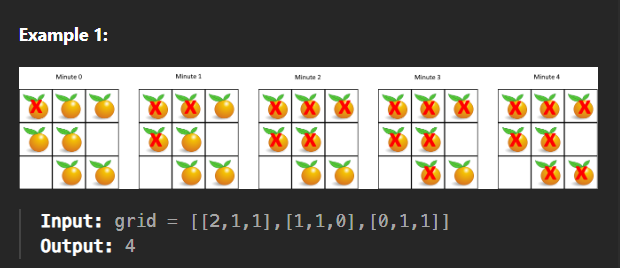

# Rotten Oranges

### Problem [Link](https://leetcode.com/problems/rotting-oranges/)

## Problem Statement

# 🟠 Rotten Oranges

You are given an `m x n` grid where each cell can have one of the following values:

- `0` → An **empty cell**
- `1` → A **fresh orange**
- `2` → A **rotten orange**

Every **minute**, any fresh orange that is **4-directionally adjacent** (up, down, left, right) to a rotten orange becomes rotten.

Your task is to return the **minimum number of minutes** that must elapse until **no cell has a fresh orange**.  
If it is **impossible** to rot all oranges, return `-1`.

---

## 📥 Input
- `grid`: A 2D list of size `m x n` containing integers `0`, `1`, or `2`.

## 📤 Output
- Return the minimum number of minutes to rot all oranges, or `-1` if not possible.

---

### example test cases


---
## 💡 Approaches

### 📌 Best Approach 
Multisource BFS is the most efficient way to solve this problem, as it allows us to explore all rotten oranges simultaneously and propagate their effect to adjacent fresh oranges.

#### Code (C++)
```cpp
class Solution {
public:
int orangesRotting(vector<vector<int>>& grid) {
    int n = grid.size();
    int m = grid[0].size();
    vector<vector<int>>vis(n , vector<int>(m , 0));

    queue<pair<pair<int, int> , int>>q;
    for(int i = 0 ; i<n ; i++){
        for(int j = 0 ; j<m ; j++){
            if(grid[i][j] == 2){
                q.push({{i , j} , 0});
                vis[i][j] = 1;
            }
        }
    }
    int time = 0;

    while(!q.empty()){
        int x = q.front().first.first;
        int y = q.front().first.second;
        int t = q.front().second;
        q.pop();
        int dx[4] = {-1, 0, 1, 0};
        int dy[4] = {0, 1, 0, -1};

        time = max(time , t);

        for(int i = 0 ; i<4 ; i++){
        int newx = x + dx[i];
        int newy = y + dy[i];

        if(newx >=0 && newx <n && newy >= 0 && newy < m && grid[newx][newy] == 1 && vis[newx][newy] == 0){
            q.push({{newx , newy} , t+1});
            vis[newx][newy] = 1;
        }
        }


    }


        for(int i = 0 ; i < n ; i++) {
        for(int j = 0 ; j < m ; j++) {
            if(grid[i][j] == 1 && vis[i][j] == 0) {
                return -1;  // ❌ Some oranges were never rotted
            }
        }
    }


    return time;
}
```
#### TC and SC
- **Time Complexity:** O(N*M), where N is the number of rows and M is the number of columns in the grid. Each cell is processed at most once.                   

- **Space Complexity:** O(N*M), for the queue and visited array, where N is the number of rows and M is the number of columns in the grid.

---

### Approach 1
Using DFS to explore the grid and track the time taken for each orange to rot. This approach is less efficient than BFS but can still solve the problem.
#### Code (C++)
```cpp
class Solution {
public:

int dx[4] = {-1, 0, 1, 0};
int dy[4] = {0, 1, 0, -1};

void dfs(int x, int y, int t , vector<vector<int>>&grid , vector<vector<int>>&time , int n ,int m) {
        if (x < 0 || x >= n || y < 0 || y >= m) return;
        if (grid[x][y] == 0 || time[x][y] <= t) return;

        time[x][y] = t;

        for (int i = 0; i < 4; i++) {
            dfs(x + dx[i], y + dy[i], t + 1 , grid , time , n , m);
        }
    };

    
int orangesRotting(vector<vector<int>>& grid) {
    int n = grid.size();
    int m = grid[0].size();

    vector<vector<int>> time(n, vector<int>(m, INT_MAX));


    for (int i = 0; i < n; i++) {
        for (int j = 0; j < m; j++) {
            if (grid[i][j] == 2) {
                dfs(i, j, 0 , grid , time , n , m);
            }
        }
    }

    int maxTime = 0;

    for (int i = 0; i < n; i++) {
        for (int j = 0; j < m; j++) {
            if (grid[i][j] == 1) {
                if (time[i][j] == INT_MAX) return -1; 
                maxTime = max(maxTime, time[i][j]);
            }
        }
    }

    return maxTime;
}

};
```
#### TC and SC
- **Time Complexity:** [ADD_TIME_COMPLEXITY_HERE]
- **Space Complexity:** [ADD_SPACE_COMPLEXITY_HERE]

---

### Approach 2
Normal BFS to explore the grid and track the time taken for each orange to rot. This approach is more efficient than DFS but less optimal than multisource BFS.
#### Code (C++)
```cpp

```


---

## 📝 Notes
