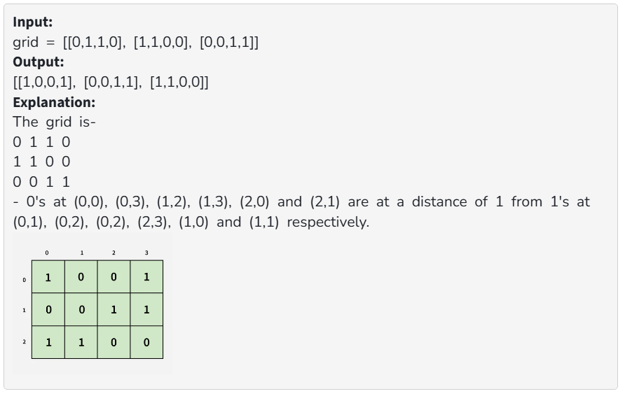

# Distance_Of_nearest_cell_having_one

### Problem [Link](https://www.geeksforgeeks.org/problems/distance-of-nearest-cell-having-1-1587115620/1)

## Problem Statement
Given a binary grid of n*m. Find the distance of the nearest 1 in the grid for each cell.
The distance is calculated as |i1  - i2| + |j1 - j2|, where i1, j1 are the row number and column number of the current cell, and i2, j2 are the row number and column number of the nearest cell having value 1. There should be atleast one 1 in the grid.

### example test cases

---
## 💡 Approaches

### 📌 Best Approach 
Multisource BFS is the most efficient way to solve this problem, as it allows us to explore all cells simultaneously and propagate the distance to adjacent cells.
#### Code (C++)
```cpp
class Solution {
  public:
    // Function to find distance of nearest 1 in the grid for each cell.
    vector<vector<int>> nearest(vector<vector<int>>& grid) {
        int n = grid.size();
        int m = grid[0].size();
        
        vector<vector<int>>vis(n , vector<int>(m , 0));
        vector<vector<int>>dist(n , vector<int>(m , 0));
        queue<pair<pair<int, int> , int>>q;
        
        for(int i =0 ; i<n ; i++){
            for(int j =0  ; j<m ; j++){
                if(grid[i][j] == 1){
                    q.push({{i , j} , 0});
                    vis[i][j] = 1;
                }
                else {
                    vis[i][j] = 0;
                }
                
            }
        }
        
        while(!q.empty()){
            int x = q.front().first.first;
            int y = q.front().first.second;
            int steps = q.front().second;
            
            q.pop(); 
            
            dist[x][y] = steps;
            
            int delx[4] = {-1 , 0 , 1 , 0};
            int dely[4] = {0, 1 , 0 , -1};
            
            for(int i = 0 ; i<4 ; i++){
                int newx = x + delx[i];
                int newy = y + dely[i];
                
                if(newx >= 0 && newx < n && newy >=0 && newy <m && vis[newx][newy] == 0){
                    q.push({{newx , newy} , steps + 1});
                    vis[newx][newy] = 1;
                }
            }
        }
        
        return dist;
        

    }
};
```
#### TC and SC
- **Time Complexity:** [ADD_TIME_COMPLEXITY_HERE]
- **Space Complexity:** [ADD_SPACE_COMPLEXITY_HERE]

---

### Approach 1
[EXPLAIN_APPROACH_1_LOGIC_HERE]
#### Code (C++)
```cpp
// [PASTE_CODE_FOR_APPROACH_1_HERE]

```
#### TC and SC
- **Time Complexity:** O(N*M), where N is the number of rows and M is the number of columns in the grid. Each cell is processed at most once.

- **Space Complexity:** O(N*M) for the queue and visited array, where N is the number of rows and M is the number of columns in the grid. 
 
---

## 📝 Notes
- The BFS approach ensures that we explore all cells in the grid efficiently, updating distances as we go.
- The use of a queue allows us to process cells in the order they are reached, ensuring that the shortest distance is calculated first.
