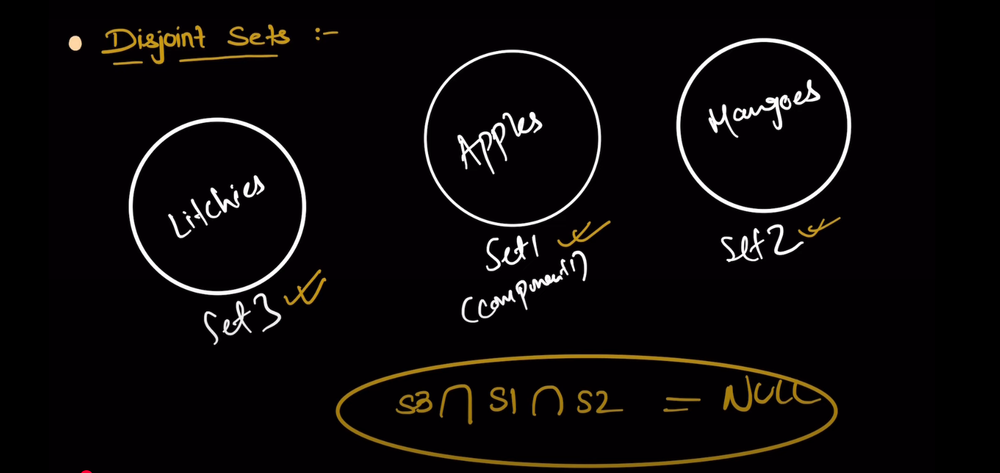
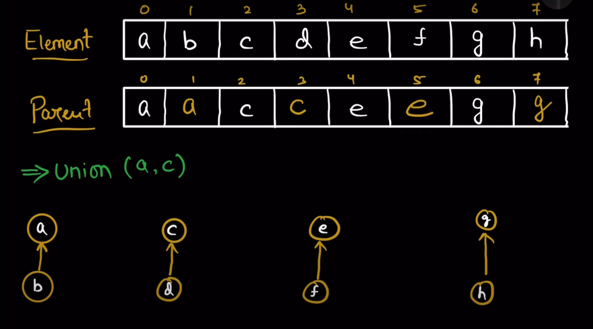

# DSU

## What is disjoint sets:


## Two operations of DSU 


## Dry run 

---

---

---

---

---

---

---

---
### Now Learning combine union in which we need to call Find to obtain their parents

---

---

---


### Similarly we can perform two operations find and join

## Pseudo code for find function

This is without path compression and rank optimization

## Pseudo code for Join function


Furthur optimizations in the join or union function can be done by using rank method by which we can make parent of the smaller tree point to the parent of the larger tree. This will help in keeping the height of the tree small and thus making the find operation faster.

Because here we can see that we are making randon parent 

but here we can insert a check to see the rank of the nodes , which node haiving more rank will be the parent of the node having less rank


### Optimizations

### Optimization 1: Path Compression
Path compression is a technique used to flatten the structure of the tree whenever `find` is called
so that all nodes directly point to the root. This makes future queries faster.

```cpp
int find(int i , vector<int>& parent) {
    if (i == parent[i]) {
        return i;

    }
    return parent[x] = find(parent[i], parent); // Path compression 
}   
``` 
### Previous code without path compression
```cpp
int find(int i , vector<int>& parent) {
    if (i == parent[i]) {
        return i;
    }
    return find(parent[i], parent);
}
``` 
### Optimization 2: Union by Rank
Union by rank is a technique used to keep the tree flat by attaching the smaller tree under the root of the larger tree. This helps in keeping the height of the tree small, which in turn makes the `find` operation faster.
```cpp
int unionByRank(int x, int y, vector<int>& parent, vector<int>& rank) {
    int rootX = find(x, parent);
    int rootY = find(y, parent);

    if (rootX != rootY) {
        if (rank[rootX] < rank[rootY]) {
            parent[rootX] = rootY;
        } else if (rank[rootX] > rank[rootY]) {
            parent[rootY] = rootX;
        } else {
            parent[rootY] = rootX;
            rank[rootX]++;
        }
    }
}
```

previous code without union by rank
```cpp
int unionByRank(int x, int y, vector<int>& parent) {
    int rootX = find(x, parent);
    int rootY = find(y, parent);

    if (rootX != rootY) {
        parent[rootY] = rootX; // Randomly attach one tree to another
    }
}
```

