## Multisource BFS

### Normal bfs
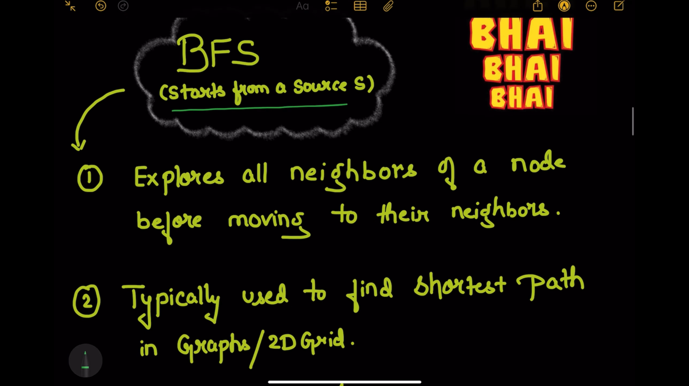
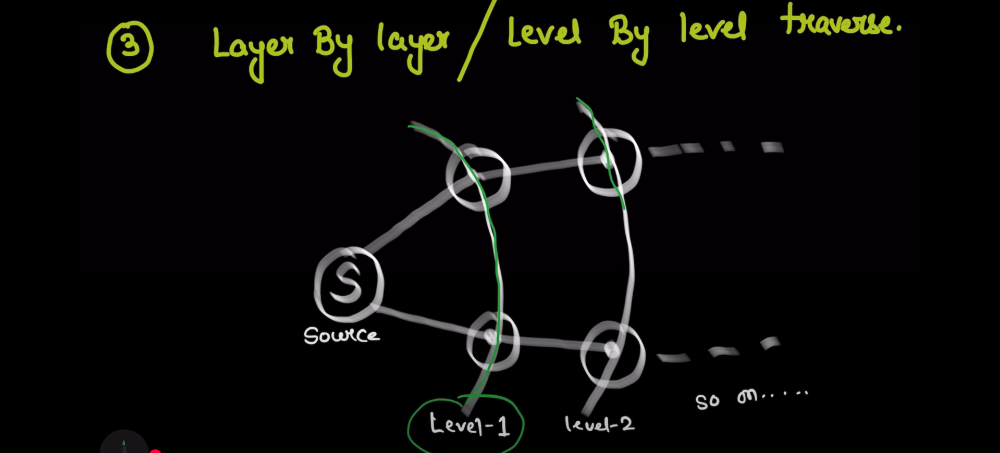

### Multi-source BFS
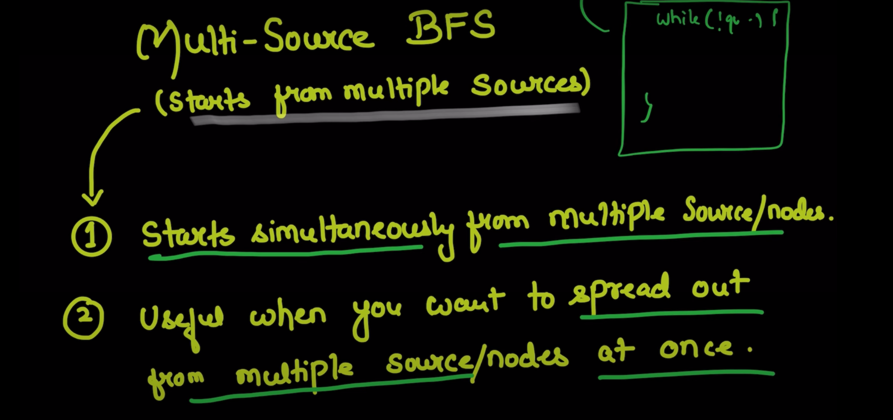
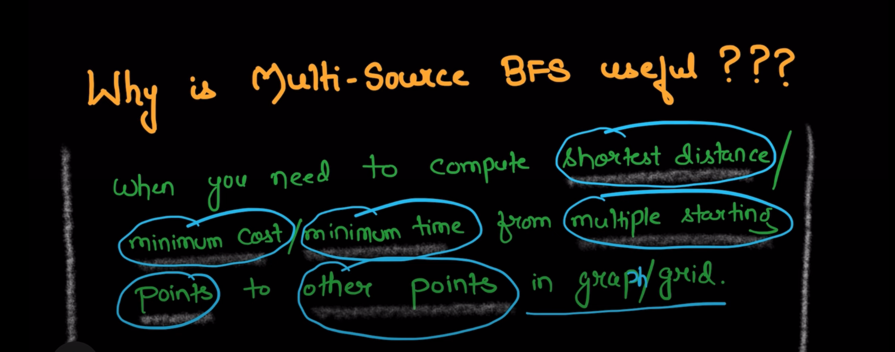  
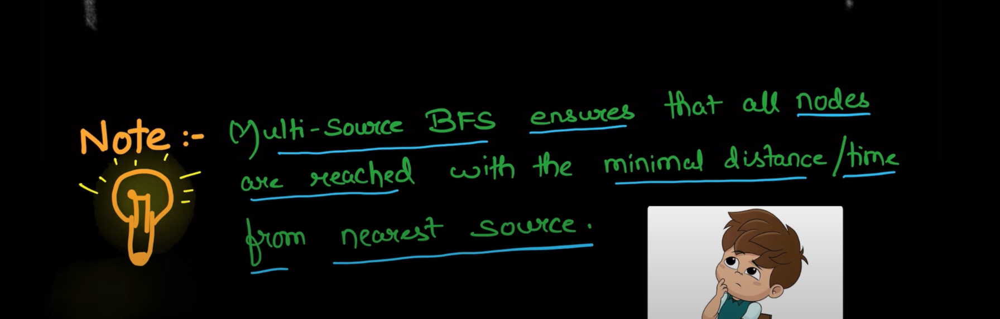   
Using one source at one time is not efficient in this case, 
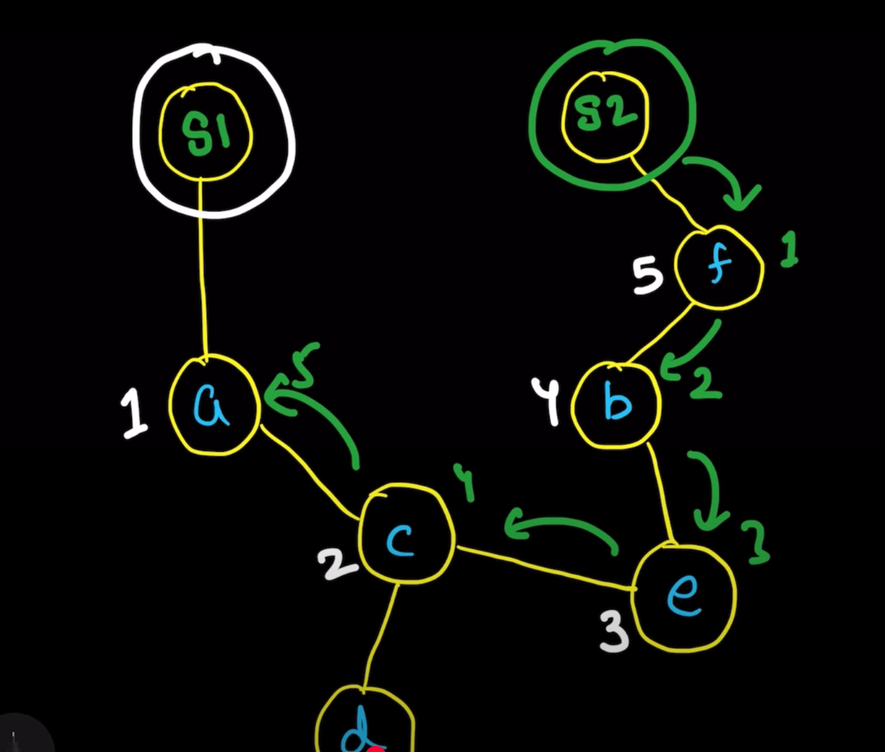   
so we can use multiple sources at one time. This is called multi-source BFS. In this case, we can use a queue to store all the sources and process them one by one. 
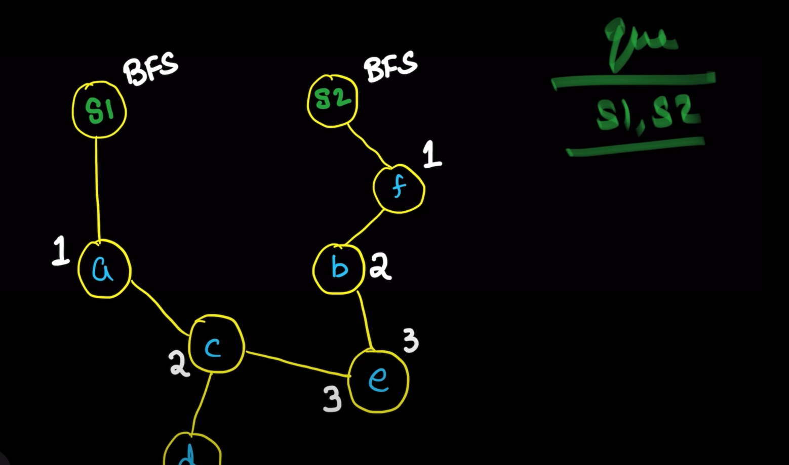

Note:
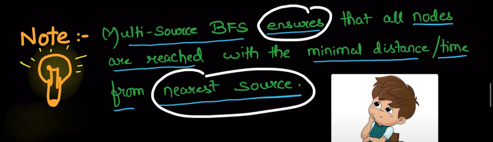

### On Grid
bfs from source 1
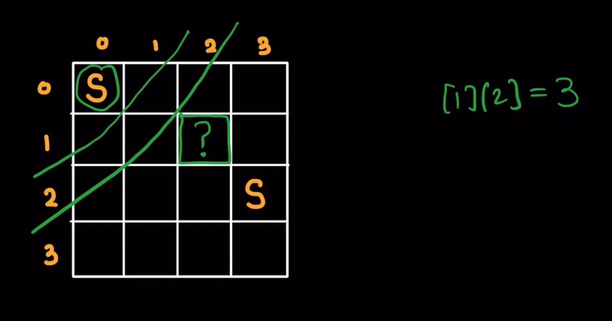
bfs from source 2
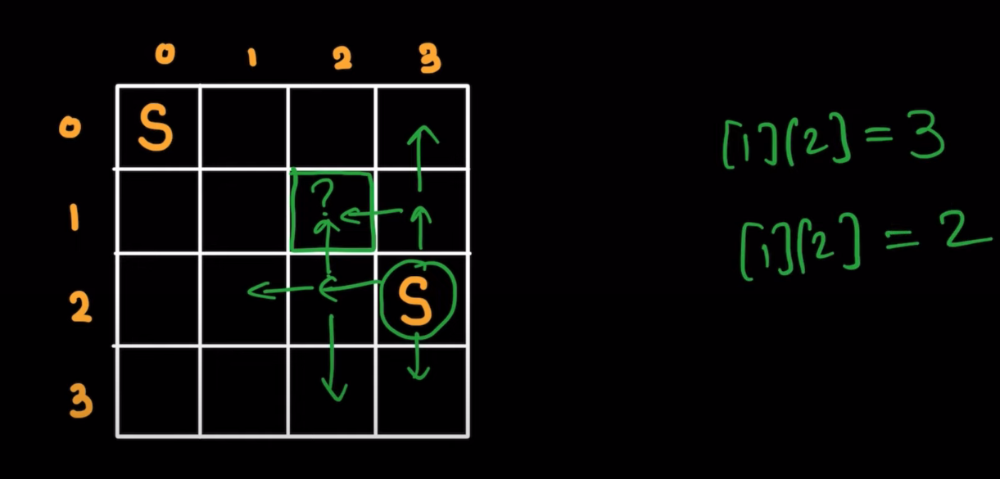
so Min time is 2

## Dry RUN
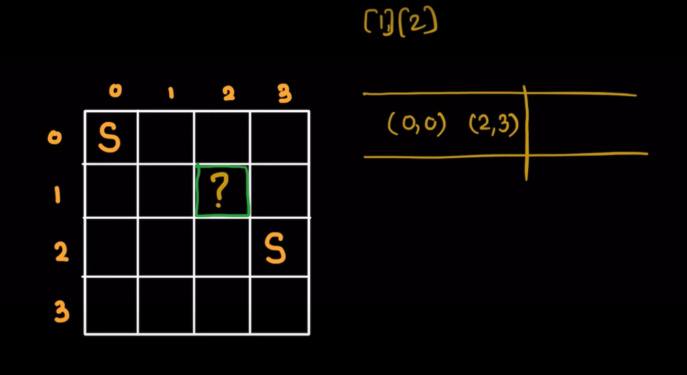
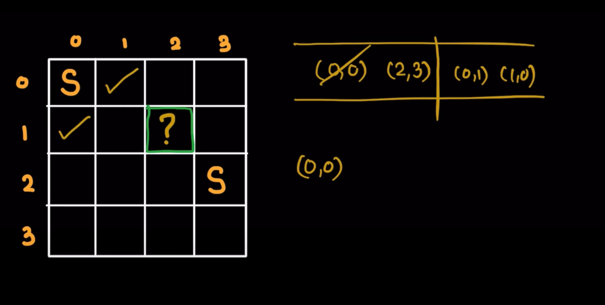
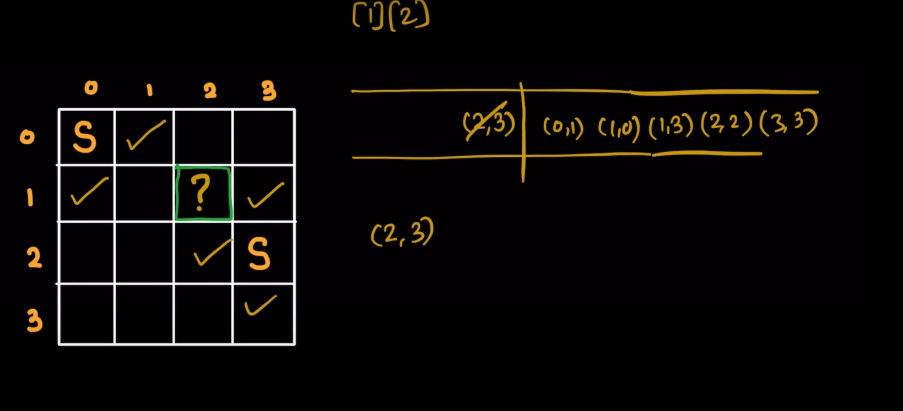
Observe first level completed
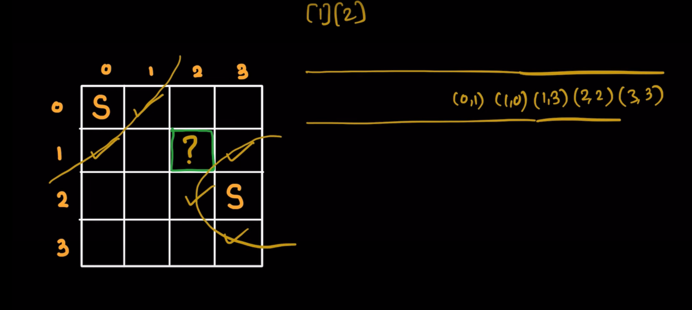
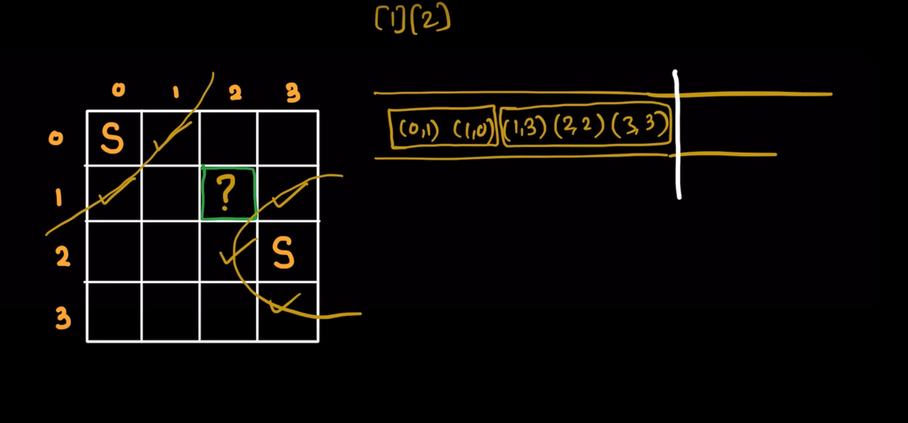
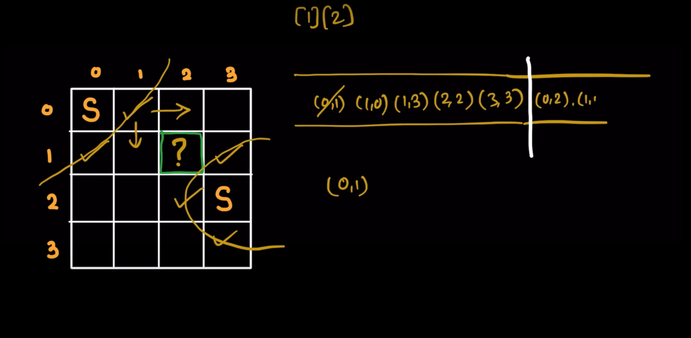
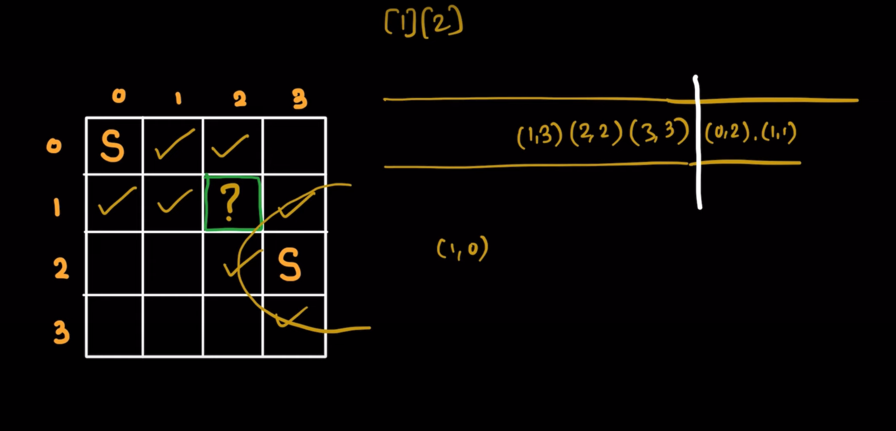
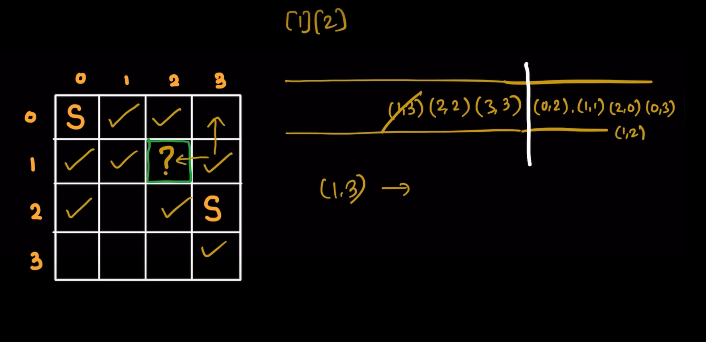
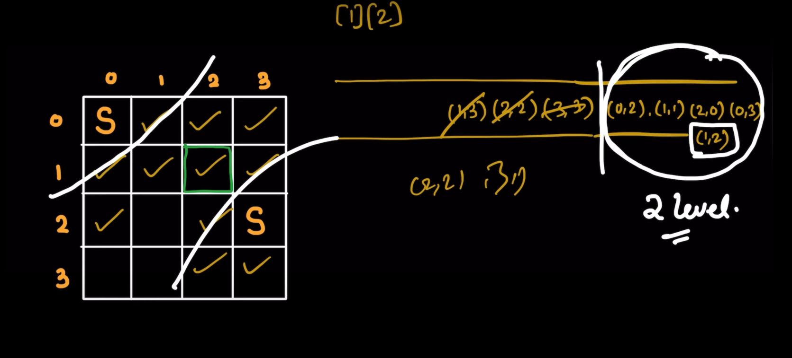